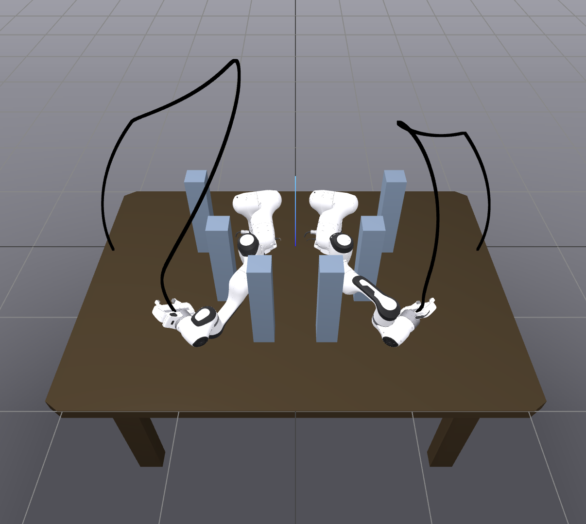

# Course project for ECE1505 (Winter 2025) on convex optimization

This repository contains all the relevant scripts and tools needed to replicate the findings presented in our final project for the [ECE1505](https://www.comm.utoronto.ca/~weiyu/ece1505/) (Winter 2025) course on convex optimization. The LaTeX files for the project report can be found [here](docs/report/).

## Results

### GCS vs PRM: minimum-length trajectory
GSC with 6 vertices        | GSC with 12(18) vertices                                                        | PRM without shortcutting                                                         |  PRM with shortcutting
:-------------------------:|:--------------------------------------------------------------------------------|:---------------------------------------------------------------------------------|:-------------------------:
  |                                                    |                                                              |  
https://github.com/user-attachments/assets/74af149b-9eeb-43c4-aa7c-560e171d6d49 | https://github.com/user-attachments/assets/eef77433-b89f-47aa-a588-93078fb21dd5 | https://github.com/user-attachments/assets/876d743b-ca6b-4405-8fe4-80f741d1be21  |  https://github.com/user-attachments/assets/d112b4ef-ae9f-4637-8274-0ea3b0118139


### GCS: extension
Time optmization           | Length optimization                                                             | The energy of the time derivative of the trajectory optimization
:-------------------------:|:--------------------------------------------------------------------------------|:-------------------------:
|                                                      |  
https://github.com/user-attachments/assets/0115b37b-0fba-4ef8-aed8-b1e906f8003b | https://github.com/user-attachments/assets/54cd1f73-277f-49c6-bec4-b8a3ab48aef6 | https://github.com/user-attachments/assets/4d4af3cc-16d1-4cb3-a91b-2ed3b9b5f552


## Installation

This project heavily depends on [Drake](https://drake.mit.edu) and the [Open Motion Planning Library (OMPL)](https://ompl.kavrakilab.org). Follow the steps below to set up and install all necessary dependencies.

**Clone the Repository (including submodules):**

```bash
git clone --recurse-submodules https://github.com/utiasSTARS/ece1505-w25-project
cd ece1505-w25-project
```

If you forgot `--recurse-submodules`, run these commands inside the repo:
```bash
git submodule init
git submodule update
```

**Create and Activate a Virtual Environment:**

It is highly recommended to use a virtual environment to isolate project dependencies:

```bash
python3.12 -m venv .venv
source .venv/bin/activate
```

**Install Dependencies:**

Main python dependencies:
```bash
pip install -r requirements.txt
```

### Setting up OMPL

This project depends on the latest 1.7.0 release of the Open Motion Planning Library (OMPL) and requires its Python bindings. As of this writing, OMPL does not have a PyPI package that can be installed directly via pip. Therefore, it must be installed manually. While there is no official installation method, the following is a recommended approach:

You can install the wheel file directly in your virtual environment. Download the appropriate wheel file from this [link](https://github.com/ompl/ompl/releases/tag/1.7.0) based on your system.

Once downloaded, install the wheel using `pip`:
```bash
pip install <wheel-file>.whl
```

## Usage

### Teleoperation of Manipulator Joints in Drake

Run the following command in the top-level directory of the repo:
```bash
python examples/joints_teleop.py --initial_conf <initial_conf>
```
<initial_conf> can be zeros, start or goal.
After running the command, click on the provided link (likely http://localhost:7000). 
Once the page opens in your browser, click the "Open Controls" button 
in the top-right corner to open the joint control sliders.

### Running Drake + OMPL demo
Run the following command in the top-level directory of the repository:
```bash
python examples/drake_ompl_planning.py
```

This should move the arms from an initial configuration to a goal configuration using the RRTConnect planner.

### Benchmarking OMPL Planners

You can run the following script to benchmark the performance of OMPL planners:
```bash
python examples/drake_ompl_benchmarking.py
```

The script will generate .pkl files under the benchmarks folder. You can use them to replicate the results in the report using the provided [notebook](notebooks/plot_statistics.ipynb).

Adjust the following configurations as needed:
```py
###############################
# Benchmarking Configurations #
###############################

PLANNERS = [
    "PRM",  # only PRM is supported at the moment
]

# this serves as a timeout value
# planning will stop as soon as it found an initial solution
RUNTIME_LIMIT = 3

RUN_COUNT = 1
SHORTCUTTING = True
PRECOMPUTE = False
PRECOMPUTATION_TIME = 10

# this is used when PRECOMPUTE is set to False

STORAGE_PATHS = {
    "PRM": os.path.join(
        CURRENT_DIR, "../data/PRM-600s.graph"
    ),  # 600s precomputed roadmap
}
```
`SHORTCUTTING` can be turned off to run the vanilla PRM; otherwise, it is enabled by default. We use the recent shortcutting approach proposed in [RRT-Rope](https://ieeexplore.ieee.org/abstract/document/9659071/?casa_token=litbc_-XX08AAAAA:03pWiotQEAXvHXJJBNOk5vNHlFvx1sWlrpQLe3qrlsBA7KdQYo1hQGBqj5sjU-d3hQgnVJBYEw). We also rely on a precomputed PRM roadmap to ensure consistent planning results, which is provided through the `STORAGE_PATHS` parameter. If you want to regenerate the roadmap, set the `PRECOMPUTE` parameter to True. This will generate a new PRM graph in the benchmarks folder—make sure to provide the correct `STORAGE_PATHS` for subsequent runs.

**Caveats**

We have experienced issues when loading the roadmap back into PRM using the OMPL planner's storage functionality. OMPL internally relies on Boost to serialize and deserialize storage data, and we suspect the issue may be due to mismatched Boost versions. This benchmark script has been successfully tested on macOS 15 but not on Ubuntu 22.04.

### Motion Planning with Graph of Convex Sets

We also formulate the problem of generating collision-free, kinodynamic motion plans as a mixed-integer convex program using the Graph of Convex Sets (GCS) approach. More information and runnable demos can be found [here](examples/drake_gcs_planning/).
